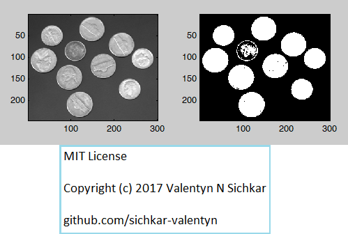
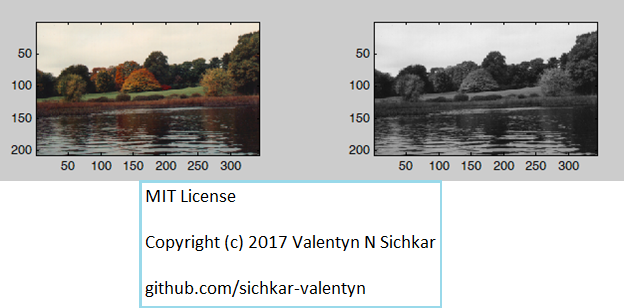
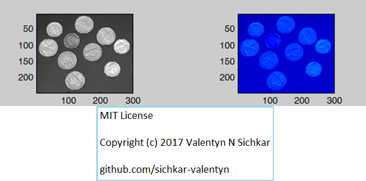
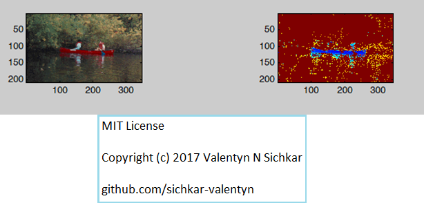
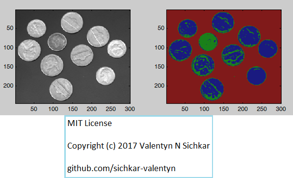
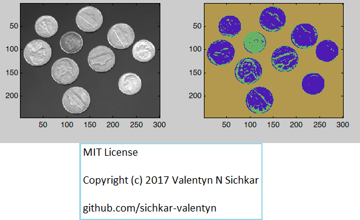
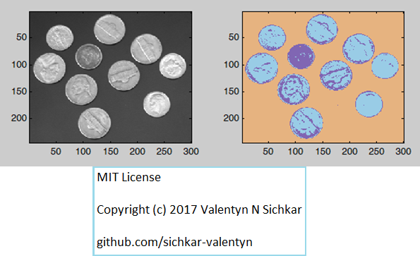

# Matlab_image_converting
Using MATLAB functions, convert images in different formats

## Description

Learning Matlab's functions for image converting

## Converting Grayscale to Binary

## Converting True-Color into Grayscale

## Converting Grayscale into Indexed using MATLAB Map

## Converting Indexed into True-Color using MATLAB Map

## Converting Grayscale into Indexed using 3x3 Map

## Converting Grayscale into Indexed using 3x4 Map

## Converting Grayscale into Indexed using 3x5 Map

## MIT License
## Copyright (c) 2017 Valentyn N Sichkar
## github.com/sichkar-valentyn
